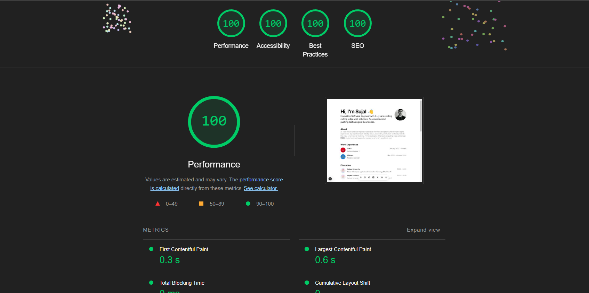

# Modern Portfolio & Blog Template

A modern, responsive portfolio and blog template built with Next.js 15, React, TypeScript, and TailwindCSS. Features a sleek design with smooth animations, dark mode support, and optimized performance.




## ✨ Features

- 🚀 Lightning-fast performance with Next.js 15 App Router
- 🎨 Beautiful UI components from [shadcn/ui](https://ui.shadcn.com/)
- ✨ Smooth animations with [Magic UI](https://magicui.design/) and Framer Motion
- 🌙 Dark mode support with next-themes
- 📱 Fully responsive design
- 📝 Integrated blog with MDX support
- ⚡️ Optimized for Next.js and Vercel deployment
- 🔍 SEO optimized
- 🎯 Easy customization through a single config file
- 🔒 Best in class security features to protect your site from XSS attacks and other code injection risks

## 🚀 Quick Start

1. Clone the repository:

```bash
git clone https://github.com/yourusername/portfolio
cd portfolio
```

2. Install dependencies:

```bash
npm install
```

3. Configure your portfolio:
Edit the configuration file at `src/data/resume.tsx` with your personal information.

4. Run the development server:

```bash
npm run dev
```


5. Open [http://localhost:3000](http://localhost:3000) to see your portfolio!

## 📝 Blog Posts

Add your blog posts as MDX files in the `content` directory. Each post should include frontmatter with the following format:

```markdown
---
title: 'Your Post Title'
publishedAt: '2024-01-01T00:00:00.000Z'
summary: 'Brief summary of your post'
image: 'category'
---
```


## 🛠️ Tech Stack

- [Next.js 15](https://nextjs.org/)
- [React 19](https://react.dev/)
- [TypeScript](https://www.typescriptlang.org/)
- [Tailwind CSS](https://tailwindcss.com/)
- [shadcn/ui](https://ui.shadcn.com/)
- [Magic UI](https://magicui.design/)
- [Framer Motion](https://www.framer.com/motion/)
- [MDX](https://mdxjs.com/)

## 📦️ Security Features

The template comes with built-in security features:

- **Content Security Policy (CSP)**: Prevents XSS attacks and other code injection risks
- **Security Headers**:
  - `X-Content-Type-Options`: Prevents MIME type sniffing
  - `X-Frame-Options`: Protects against clickjacking
  - `Referrer-Policy`: Controls how much referrer information is shared
  - `upgrade-insecure-requests`: Upgrades HTTP requests to HTTPS

## 📦 Project Structure

```
├── src/
│ ├── app/ # Next.js app router pages
│ ├── components/ # React components
│ ├── data/ # Configuration and data files
│ ├── lib/ # Utility functions
│ └── styles/ # Global styles
├── content/ # Blog posts in MDX format
├── public/ # Static assets
└── ...
```


## 🤝 Contributing

Contributions are welcome! Please read our [Contributing Guide](CONTRIBUTING.md) for details on our code of conduct and the process for submitting pull requests.

## 📄 License

This project is licensed under the MIT License - see the [LICENSE](LICENSE) file for details.

## 🙏 Acknowledgments

- [shadcn/ui](https://ui.shadcn.com/) for the beautiful UI components
- [Magic UI](https://magicui.design/) for the animation components
- [Vercel](https://vercel.com) for hosting

---

Built with ❤️ using Next.js and React